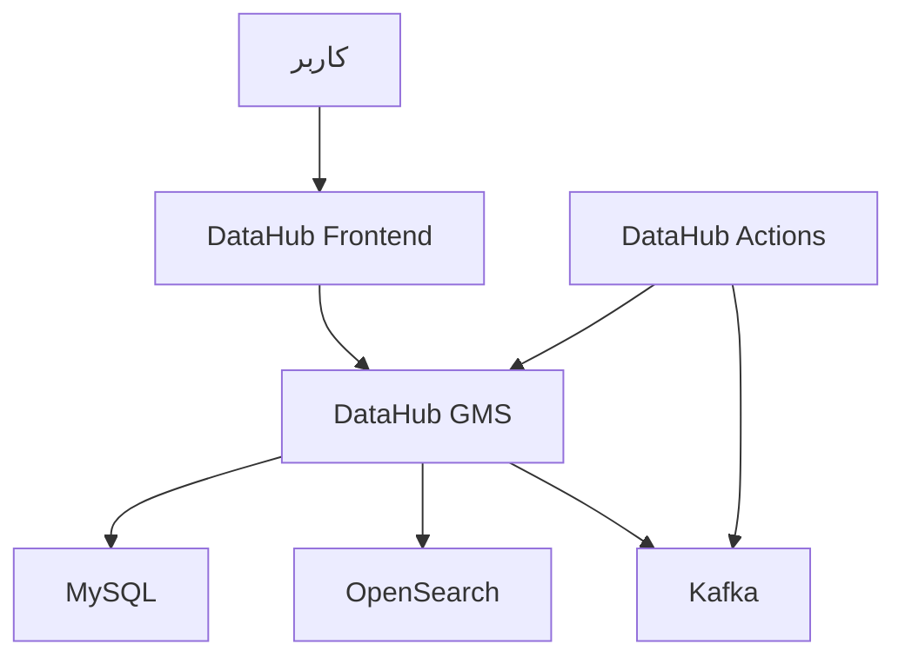

# ساختار DataHub Quickstart

این مخزن ساختار Docker Compose استفاده‌شده برای اجرای **DataHub v1.7.0** را نگهداری می‌کند.

این پیاده‌سازی از نوع **Quickstart** است؛ یعنی برای یادگیری، بررسی قابلیت‌ها و محیط آزمایشی مناسب است و یک استقرار Production کامل محسوب نمی‌شود.

## معماری



کاربر از طریق Frontend وارد DataHub می‌شود. Frontend درخواست‌ها را به GMS می‌فرستد. GMS سرویس اصلی DataHub است و برای نگهداری Metadata، جست‌وجو و انتقال رویدادها از MySQL، OpenSearch و Kafka استفاده می‌کند.

## سرویس‌ها

| سرویس | وظیفه |
|---|---|
| `frontend-quickstart` | رابط وب DataHub |
| `datahub-gms-quickstart` | سرویس اصلی و APIهای DataHub |
| `mysql` | نگهداری Metadata اصلی |
| `opensearch` | جست‌وجو و Index کردن Metadata |
| `kafka-broker` | انتقال رویدادها بین سرویس‌ها |
| `datahub-actions-quickstart` | پردازش رویدادها و اجرای Actionها |
| `system-update-quickstart` | آماده‌سازی اولیه دیتابیس، Topicها و Indexها |

`system-update-quickstart` یک Job موقت است و پس از آماده‌سازی موفق با وضعیت `Exited (0)` متوقف می‌شود.

## جریان اجرای سرویس‌ها

1. MySQL، Kafka و OpenSearch اجرا می‌شوند.
2. سرویس `system-update-quickstart` ساختارهای اولیه را ایجاد می‌کند.
3. سرویس GMS اجرا می‌شود.
4. Frontend و DataHub Actions به GMS متصل می‌شوند.

## ساختار مخزن

```text
datahub/
├── README.md
├── docker-compose.yml
├── quickstart_version_mapping.yaml
├── .env.example
├── .gitignore
├── plugins/
│   └── .gitkeep
└── search/
    └── .gitkeep
```

| فایل یا پوشه | کاربرد |
|---|---|
| `docker-compose.yml` | تعریف سرویس‌ها، شبکه، Volumeها و Health Checkها |
| `.env.example` | نام متغیرهای محیطی بدون Secret واقعی |
| `quickstart_version_mapping.yaml` | نگاشت نسخه‌های Quickstart و Imageها |
| `plugins/` | محل Pluginهای سفارشی |
| `search/` | محل تنظیمات سفارشی جست‌وجو |

## شبکه و ذخیره‌سازی

همه سرویس‌ها در شبکه داخلی `datahub_network` با یکدیگر ارتباط دارند.

داده‌های MySQL، OpenSearch و Kafka در Docker Volumeهای جداگانه نگهداری می‌شوند تا با حذف کانتینرها از بین نروند.

## نکته امنیتی

فایل `.env` واقعی داخل مخزن قرار نمی‌گیرد. تمام Passwordها و Secretها در Compose از متغیرهای محیطی خوانده می‌شوند و فقط نام آن‌ها در `.env.example` ثبت شده است.

این Quickstart برای Production آماده نیست، چون تنظیمات آن شامل ساده‌سازی‌هایی مانند ارتباط داخلی بدون TLS، Kafka با `PLAINTEXT`، OpenSearch بدون Security Plugin و انتشار چند پورت زیرساختی روی Host است.

برای Production باید Authentication، TLS، محدودیت شبکه، مدیریت Secret، Backup و مانیتورینگ جداگانه طراحی شوند.
